## Fine-Tuning GPT-4o Model - A Dashboard Experience
Learn how to fine-tune a GPT-4o model using Azure AI Foundry - UI Dashboard.  

### Prerequisites
* Learn the [what, why, and when to use fine-tuning.](https://learn.microsoft.com/en-us/azure/ai-services/openai/concepts/fine-tuning-considerations)
* An Azure subscription.
* Access to Azure AI Foundry Service.
* An Azure OpenAI resource created in the supported fine-tuning region (e.g. Sweden Central).
* GPT Models that support fine-tuning so far:
  * *gpt-35-turbo-1106*
  * *gpt-35-turbo-0125*
  * *gpt-4o-mini*
  * *gpt-4o*
  * *gpt-4.1-mini*
  * *gpt-4.1-nano*
  * *o4-mini
  
* Prepare Training and Validation datasets:
  * at least 50 high-quality samples (preferably 1,000s) are required.
  * must be formatted in the JSON Lines (JSONL) document with UTF-8 encoding.

You can check the MS Learn document [here](https://learn.microsoft.com/en-us/azure/ai-services/openai/how-to/fine-tuning?tabs=turbo%2Cpython&pivots=programming-language-studio) for more details.

### Step 1: Open the *Create a custom model* wizard
1. Open Azure AI Foundry at [https://ai.azure.com/](https://ai.azure.com/) and sign in with credentials that have access to your Azure AI Foundry resource. In the **connected resources** tab, make sure that an Azure OpenAI resource is already connected to your AI Foundry Hub.
2. In Azure AI Foundry, choose an existing project or create a new project. <ol>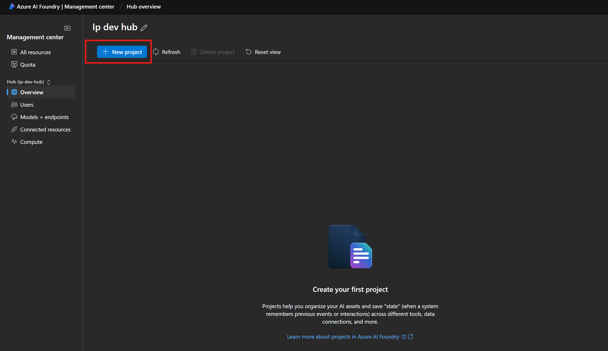</ol>
3. Once we have our project created, browse to the **Fine-tuning** pane, and select **Fine-tune model**.
<ol>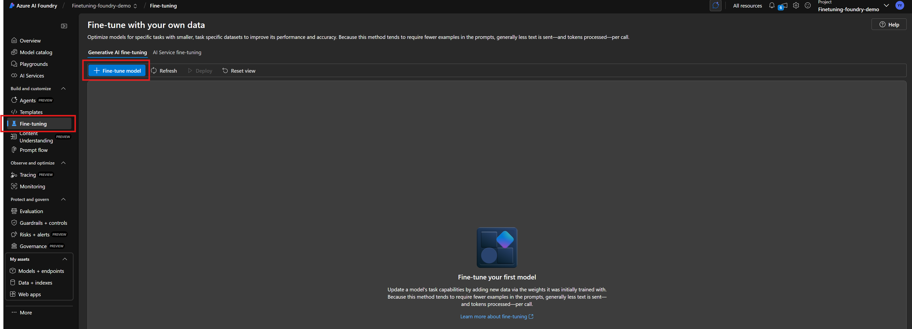</ol>

### Step 2: Select the *Base model*
The first step in creating a custom model is to choose a base model. In this demo, we choose *gpt-4o-mini*.

The **Base model** pane lets you choose a base model to use for your custom model. Select the base model *gpt-4o-mini* from the **Base model type** dropdown, and then select **Next** to continue.
<ol>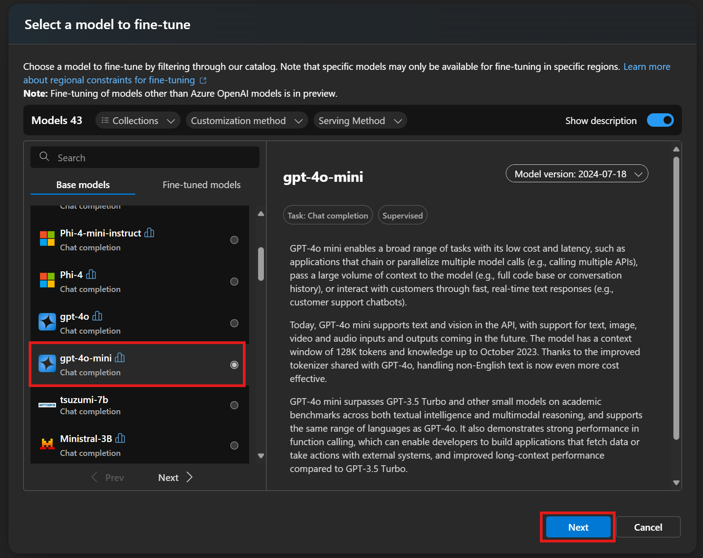</ol>

### Step 3: Choose your *Training data*
The next step is to choose a finetuning method (Supervised, DPO or Reinforcement) and your training & validation data either from the previously uploaded ones or by uploading a new ones. (Validation data is not required)
<ol>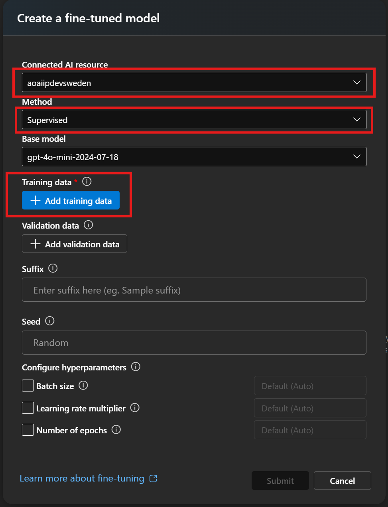</ol>

To upload a new training data, Select **Add Training data** and then you can use one of the following options:(Note: make sure that you have the right permissions like Azure Blob Storage Contributor so you can upload new data) 
* Select **Upload files** to upload training data from a local file.
  <ol>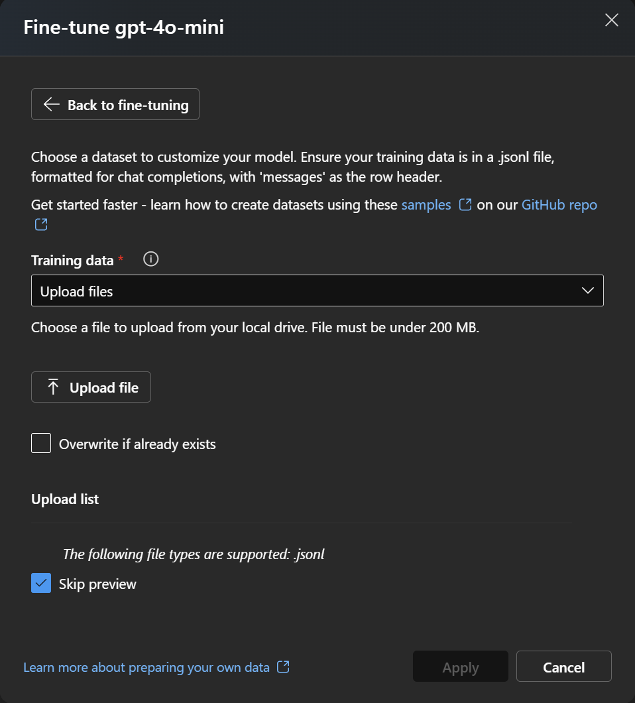</ol>
* Select **Azure blob or other shared web locations** to import training data from Azure Blob or another shared web location.
  <ol>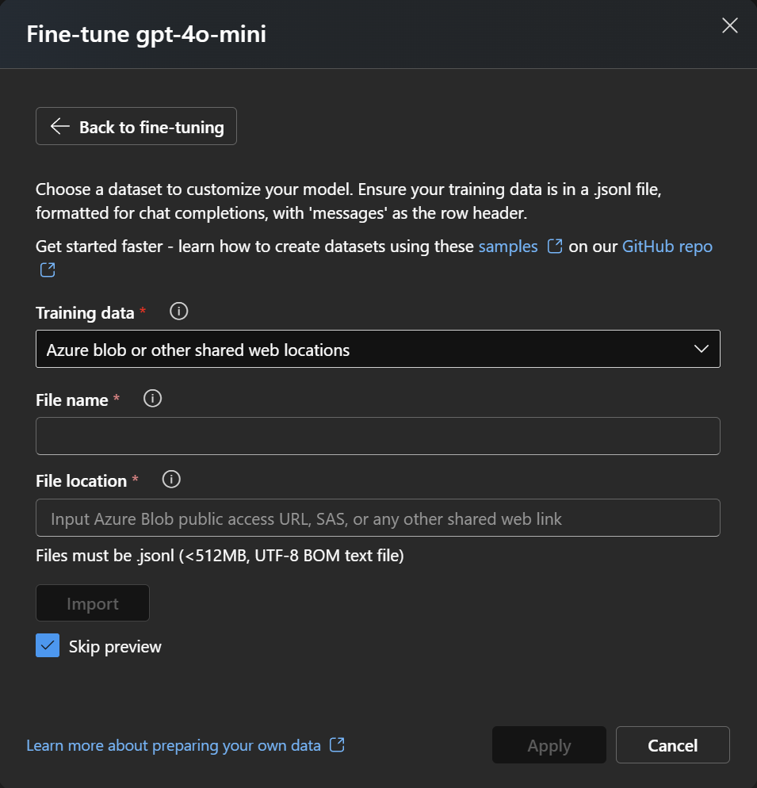</ol>
* Select **Data in Azure AI Foundry** to use an existing dataset already registred in Azure AI Foundry.
  <ol>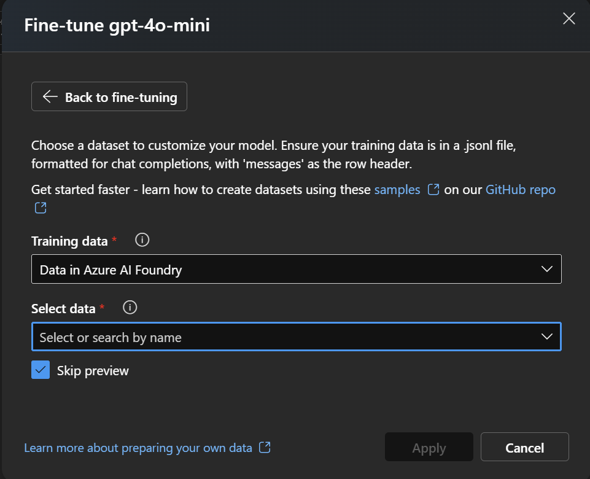</ol>

### Step 4 (Optional): Choose your *Validation data*
Once, Training data is uploaded, you can choose your validation data by following the similar pattern as you upload your training data.
<ol>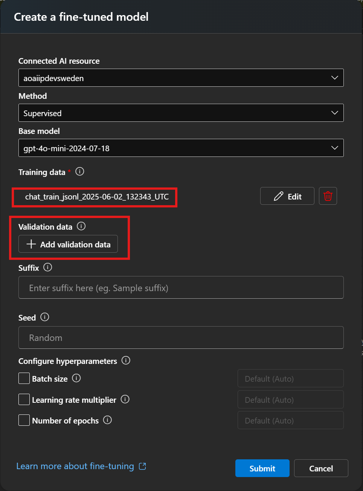</ol>

### Step 5 (Optional): Configure *Advanced options*
Default values are automatically set to the fine-tuning job. You can either keep them as is or semect the hyperparameters you wish to customize.
<ol>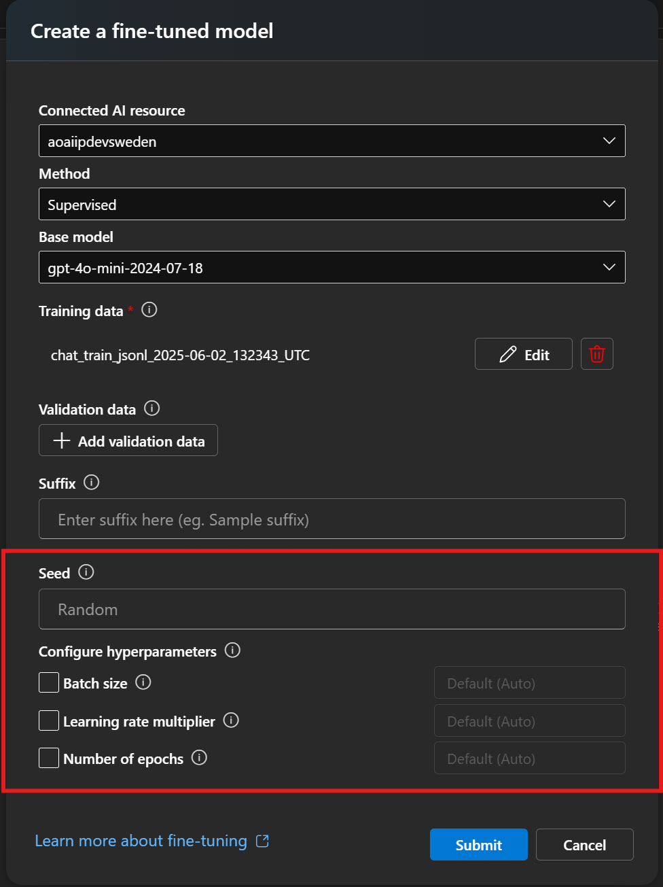</ol>

One can refer to the MS Learn document [here](https://learn.microsoft.com/en-us/azure/ai-services/openai/how-to/fine-tuning?tabs=turbo%2Cpython&pivots=programming-language-studio#configure-advanced-options) for a detailed explanation on key tun-able hyperparameters.

### Step 6: Review your choices and *Submit*
If you're ready to train your model, select **Submit** to start the fine-tuning job and return to the **Fine-tuning** pane.

You can check the status of the custom model in the **Status** column of the **Fine-tuning** pane.
<ol>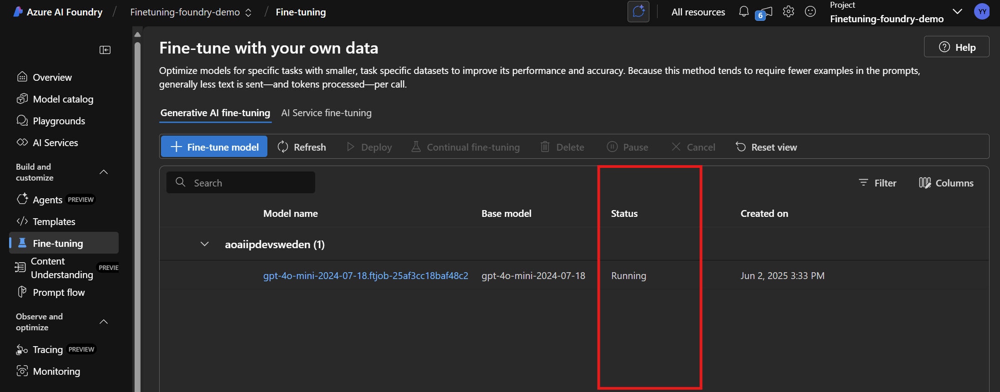</ol>

After you start a fine-tuning job, it can take some time to complete (from minutes to hours) depending on your training datset size and also hyperparamters value.
<ol>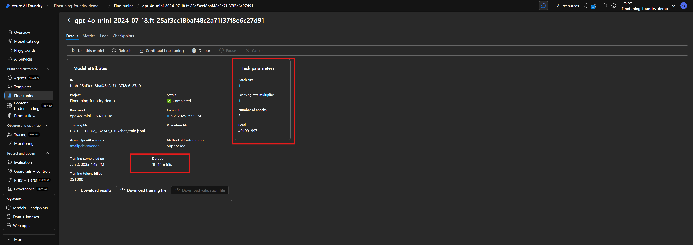</ol>

### Step 7: Deploy a custom model
When the fine-tuning job succeeds, you can use and deploy the fine-tuned model from the **Fine-tuning** pane.

To deploy your custom model, select the fine-tuned model to deploy, and then select **Use this model**.
<ol>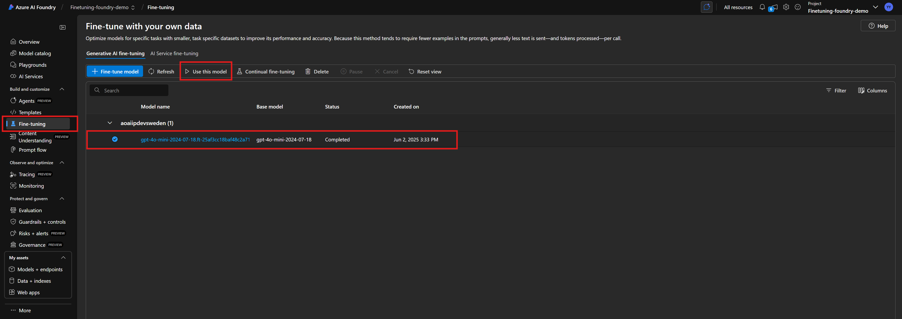</ol>

The **Deploy model** dialog box opens. 

In the dialog box, enter your **Deployment name** and then select **Deploy** to start the deployment of your custom model.
<ol>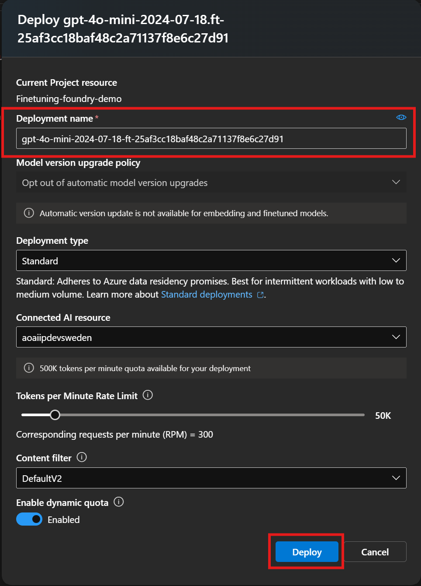</ol>

### Step 8: Test and use a deployed model
After your custom model deploys, you can use it like any other deployed model. 

You can navigate to **Playgrounds** in [Azure AI Foundry ]("https://ai.azure.com") to experiment with your new deployment. You can also use the fine-tuned model by calling the completion API.
<ol>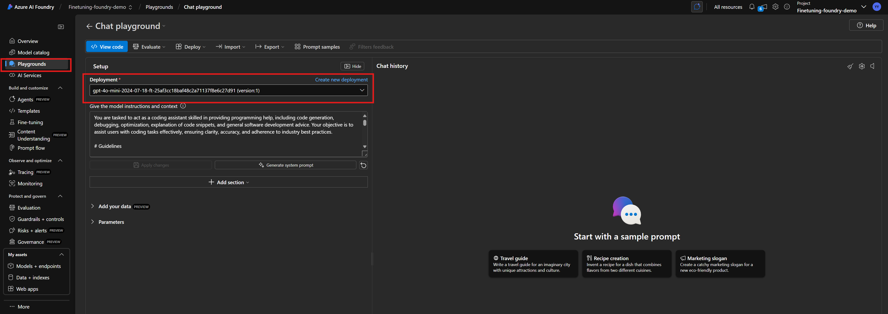</ol>

### Step 9 (Optional): Clean up your deployment resources
When you're done with your custom model, you can delete the deployment and model. You can also delete the training and validation files you uploaded to the service, if needed.

### Step 10 (Optional): Continous fine-tuning
Once you have created a fine-tuned model you may wish to continue to refine the model over time through further fine-tuning. Continuous fine-tuning is the iterative process of selecting an already fine-tuned model as a base model and fine-tuning it further on new sets of training examples.

To perform fine-tuning on a model that you have previously fine-tuned you would use the same process as described in **Step 1**, but instead of specifying the name of a generic base model, you would specify your already fine-tuned model. A custom fine-tuned model would look like <code>gpt-4o-mini-2024-07-18ft-5ff6852e38314f09bbb64b2aeb002f0a...</code>
<ol>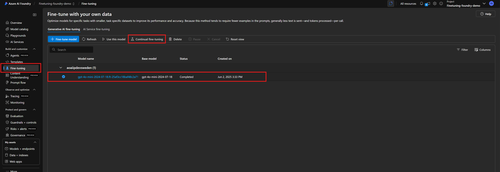</ol>
